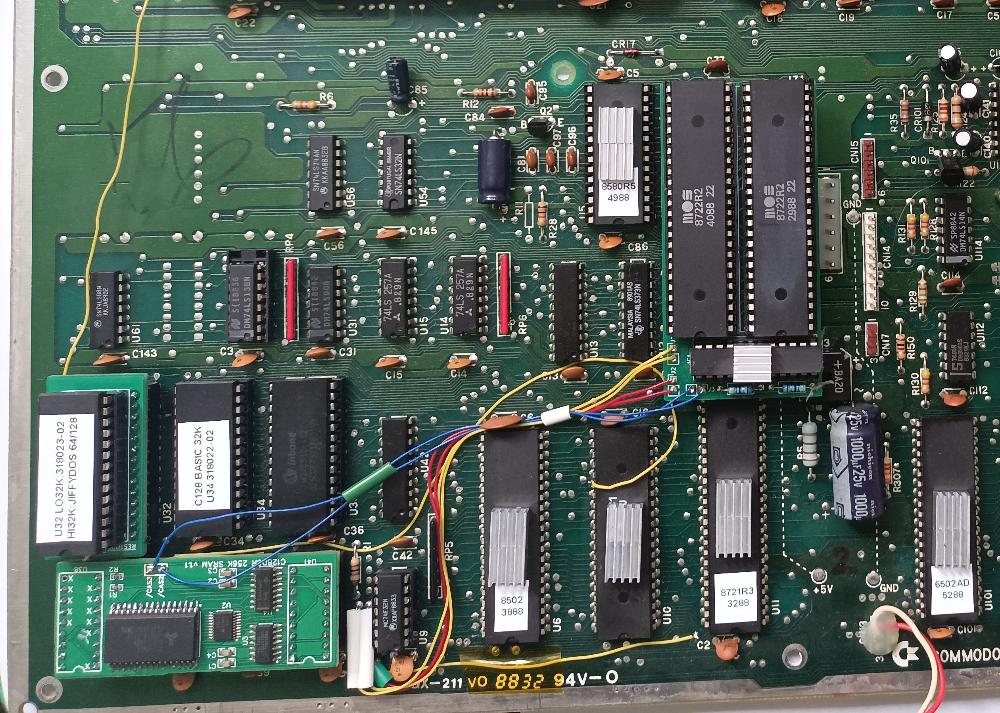
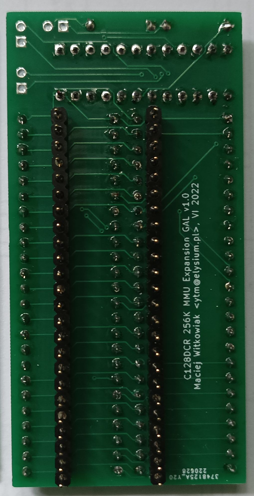
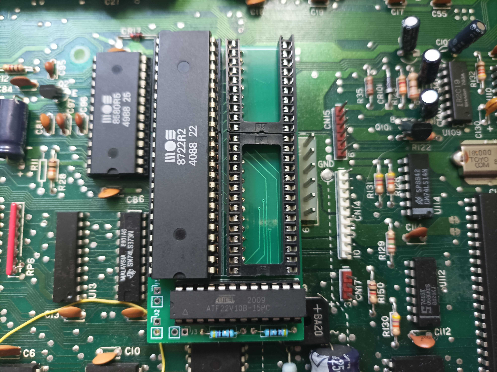
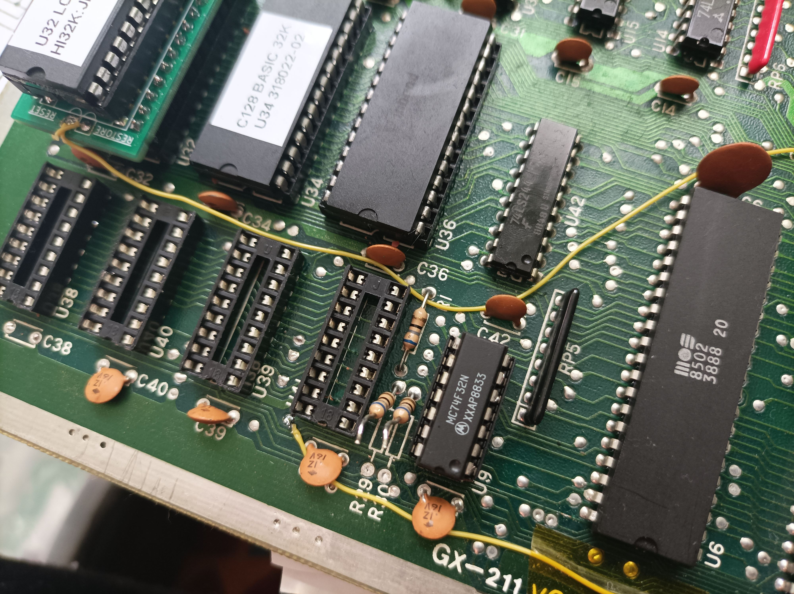
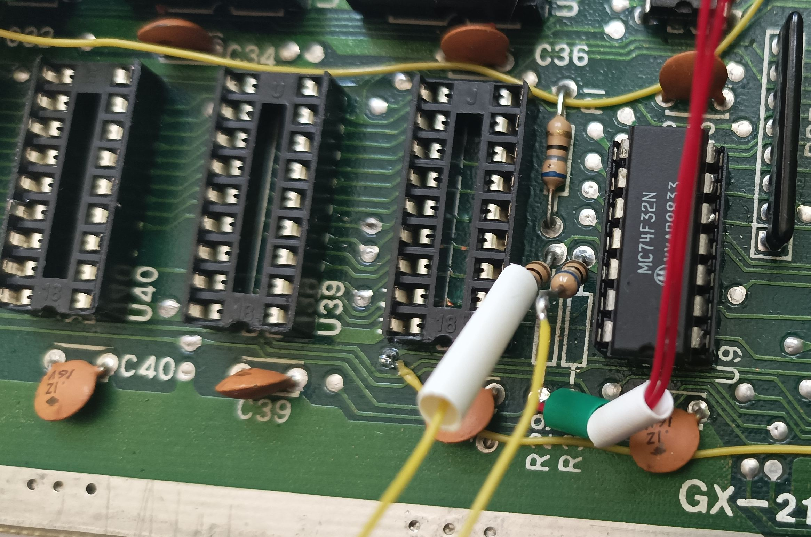
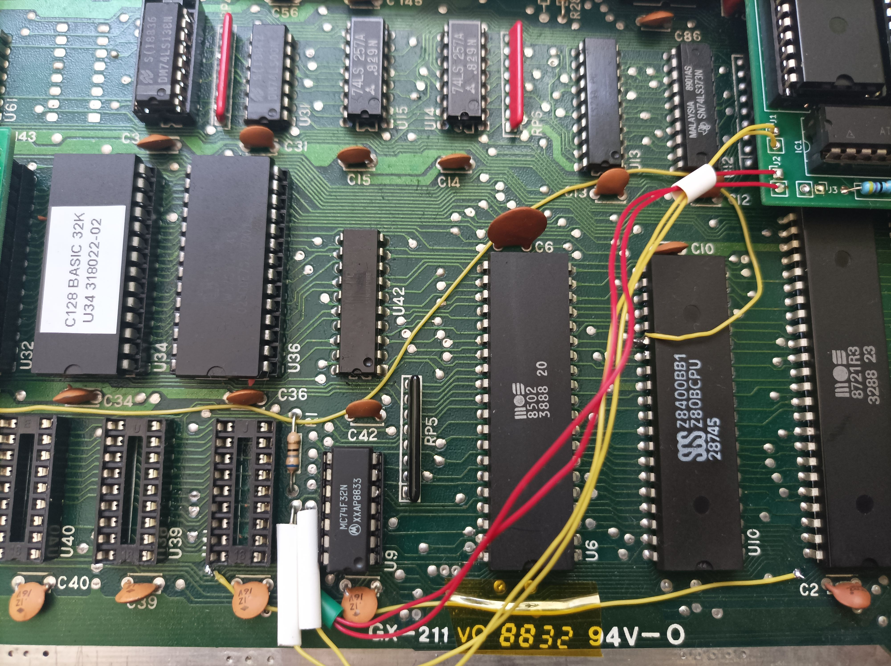
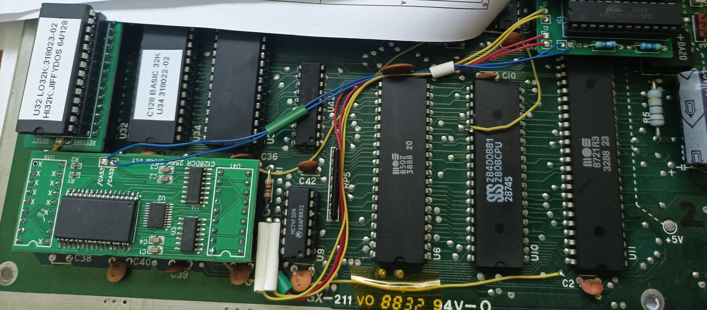
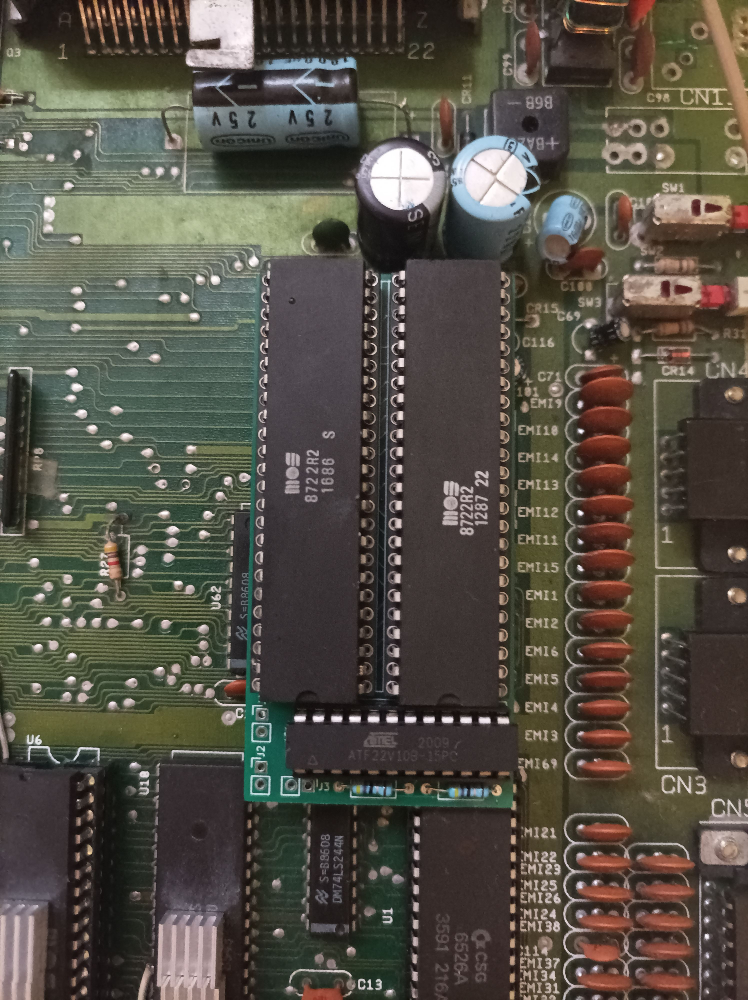
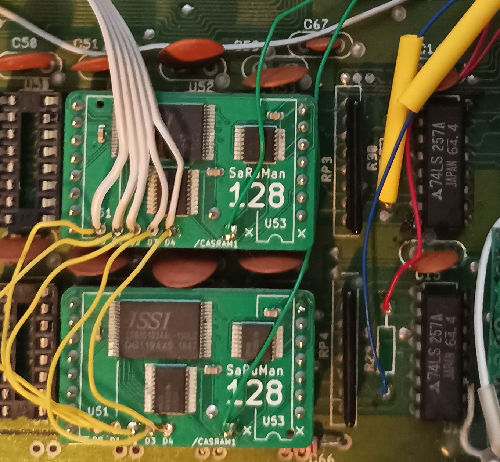
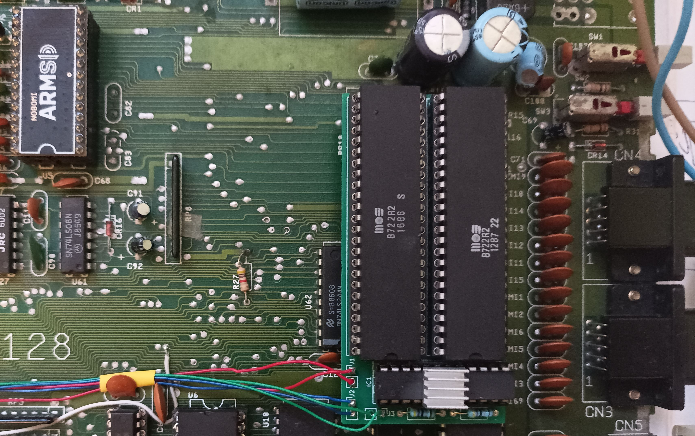

# C128 256K RAM expansion MMU daughterboard

This work is based on a project developed by Marko Mäkelä and Pekka Pessi that described expanding Commodore 128 memory to 256 or 512/1024 kilobytes of RAM.

Two KiCad projects capture schematic and PCB for 256KB expansion only.

This is a daughterboard meant to be plugged into U7 socket to raise the original MOS 8722 MMU chip and add a second one to generate `/CAS` signals for RAM banks 2 and 3. The challenge was to make it narrow enough to fit into C128DCR - there is not much space near MMU socket between power connector, power supply and SID.

For the full description of the project please read the [original documentation on zimmers.net](http://www.zimmers.net/anonftp/pub/cbm/documents/projects/memory/c128/1028/index.html).

Be warned that PS/HTML/PDF versions contain a small error (read below).

## Background

I have built this expansion by following the [TXT document](http://www.zimmers.net/anonftp/pub/cbm/documents/projects/memory/c128/1028/1028.txt) in late March 1999 and it has served me ever since.

There is not much software that uses RAM banks 2 and 3 but [I wrote some software on my own for GEOS](https://github.com/ytmytm/c64-geos-ramdrives). This kind of expansion is also emulated by VICE.

Now, over 20 years later I'm not happy with the soldering job I did in my late teens. Connections became brittle and the whole mess of wires from this and other mods makes it very difficult to repair in case something goes wrong.

These days it's so easy and cheap to order professionally manufactured PCBs that I decided to revisit the project.

## TTL project

[c128-mmu-exp-ttl](c128-mmu-exp-ttl/) folder contains KiCad 6.0 project that captures the design from the original description. With all chips moved to a daughterboard simplifications could be made and the only additional signals from the mainboard are:

- `/RAMCAS0` and `/RAMCAS1` (input from pins of U9)
- `/RAMCAS0` and `/RAMCAS1` (output to old RAM, U9 board)
- `/RAMCAS2` and `/RAMCAS3` (output to new RAM)

The original document calls for desoldering U9 and soldering some wires to the board and raised legs. However it's much more convenient to raise one leg of R29 and R30 and tie there. In case you really want to go with connecting to U9 please keep in mind that the same signals are connected to different pins on C128(D) and C128DCR.

### Design correction

I remembered that I had stumbled on a mistake in the original documentation, I just didn't leave for myself enough information what it was. This is why I started with TTL version to duplicate exactly the reference design and understand how it works.

The problem is with IC7 (74LS02) connection to IC8 (4066). IC8 (4066) pins 6 (E3) and 12 (E4) were swapped on the original schematic and in the description. 
Fortunately the authors described not only the circuit but also the theory of operation.
To make it work as described in section 3.1.1:

> pass D7 into D6 of new MMU, except for $D505 (then pass D6 as D6)

IC8 pin 6 has to be connected to IC7 pin 3 (NAND output) and IC8 pin 12 has to be connected to IC7 pins 1 and 2 (NAND input) and IC6 (74LS138) pin 10 (/O5).

Documentation in PS/PDF/HTML format has this problem. TXT version has correct ASCII drawing of the schematic, but the same mistake in description.

[Corrected schematic is here](c128-mmu-exp-ttl/plots/c128-mmu-exp.pdf). This PCB design was not tested - I never meant to build it.
There is no way to make it fit into C128DCR and keep dimensions within cheap 10x10cm board size.

## GAL project

[c128-mmu-exp-gal](c128-mmu-exp-gal/) folder contains KiCad 6.0 project for a MMU daughterboard with all the glue logic moved to a GAL22V10.

[c128-mmu-exp-gal/plots](c128-mmu-exp-gal/plots) folder contains Gerber files for manufacturing and [schematic](c128-mmu-exp-gal/plots/c128-mmu-exp.pdf).

[gal-jed](gal-jed) folder contains GAL logic prepared in WinCUPL

- JED file to be flashed into GAL
- PLD, DOC files with logic equations
- SI file with simulation cases for complete testing

### Flashing GALs

Flash the [JED](gal-jed/C128_MMU256K.jed) file into a GAL22V10. These devices are themselves obsolete. Chips that I had from an unknown Chinese source were clearly refurbished. ATMEL markings started to rub off even without using alcohol.

I have used TL866 II Plus to flash them. Remember to turn off "Encrypt chip" and "Lock bit" options.

### PCBS

Make sure to solder round pin headers under 48-pin DIP sockets first.

 

### Installation in C128DCR

#### Step 1

First test can be done right away. Just plug in the daughterboard with MMU installed into U7 socket. GAL is not yet necessary. The computer should start normally. The new PCB fits nicely just between SID and the power socket. Check carefully if the daughterboard is plugged correctly with no shifted pins hanging outside the U7 socket.

#### Step 2

Now we need to tie into `/RAMCAS0` and `/RAMCAS1` signals that go out of U9. The easiest way to do it is to raise one leg of R29/R30 and connect one wire to each raised leg and another one to pad on the mainboard.

 

- `/RAMCAS` input - from U9 chip side goes to PCB J1: bank0 (related to R29) to round pad, bank1 (related to R30) to square pad
- `/RAMCAS` output - from U9 board side goes to PCB J2: bank0 (related to R29, U38 pin 16) to round pad, bank1 (related to R30, U39 pin 16) to square pad

You can see how yellow wires - connected to R29/R30 leg - go to J1 while red wires - connected to pads near the edge of the board - go to J2.

Another way to put it: J1 connects to U9 pins, J2 connects to RAM (U38-41) pin 16

At this stage, with both MMUs and GAL installed the computer should work normally. There should be one difference: machine monitor commands `M 24000 24080` or `M 34000 34080` should show randomly changing values from unconnected RAM banks 2 and 3 instead of mirroring data from banks 0 and 1.

#### Step 3

Finally signals from J3 should be connected to `/CAS` pins of new DRAM chips piggy-backed on existing U38-U41 chips. In my case, I already had another board with [SRAM replacement for C128DCR system RAM](https://oshwlab.com/mwitkowiak/sram-test_copy).

### Installation in C128D

I don't own a flat C128, nor a C128D with a case. All I have is a rescued C128D board, so I don't really know if a populated daughterboard will fit inside a case and under the keyboard.

The daughterboard doesn't reach capacitors in the back and just barely covers CIA in the front.

I'm using SRAM here as well - two [SaRuMan 128 modules](https://c-128.freeforums.net/thread/928/saruman-c128-static-replacement-board).
I decided to make things even easier for myself and removed R29/R30 completely.

Red wires are connected to U3 and go to J1 while blue wires are connected to RAM chips `/CAS` pins (15) and go to J2.

Green wires connect SRAM modules with J3.

