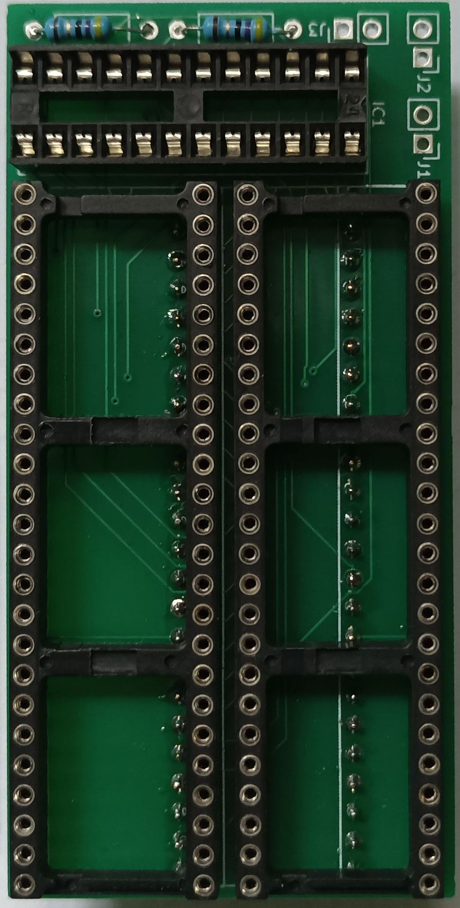

# C128 256K RAM expansion MMU daughterboard

This work is based on a project developed by Marko Mäkelä and Pekka Pessi that described expanding Commodore 128 memory to 256 or 512/1024 kilobytes of RAM.

Two KiCad projects capture schematic and PCB for 256KB expansion only.

This is a daughterboard meant to be plugged into U7 socket to raise the original MOS 8722 MMU chip and add a second one to generate `/CAS` signals for RAM banks 2 and 3. The challenge was to make it narrow enough to fit into C128DCR - there is not much space near MMU socket between power connector, power supply and SID.

For the full description please read the [original documentation on zimmers.net](http://www.zimmers.net/anonftp/pub/cbm/documents/projects/memory/c128/1028/index.html).

Be warned that PS/HTML/PDF versions contain a small error (read below).

## Background

I have built this expansion by following the [TXT document](http://www.zimmers.net/anonftp/pub/cbm/documents/projects/memory/c128/1028/1028.txt) in late March 1999 and it has served me ever since.

There is not much software that uses RAM banks 2 and 3 but [I could code my own for GEOS](https://github.com/ytmytm/c64-geos-ramdrives).

Now, over 20 years later I'm not happy with the soldering job I did in my late teens. Connections became brittle and the whole mess of wires from this and other mods makes it very difficult to repair in case something goes wrong.

These days it's so easy and cheap to order professionally manufactured PCBs that I decided to revisit the project.

## TTL project

[c128-mmu-exp-ttl](c128-mmu-exp-ttl/) folder contains KiCad 6.0 project that captures the design from the original description. With all chips moved to a daughterboard simplifications could be made and the only additional signals from the mainboard are:

- `/RAMCAS0` and `/RAMCAS1` (input from pins of U9)
- `/RAMCAS0` and `/RAMCAS1` (output to old RAM, U9 board)
- `/RAMCAS2` and `/RAMCAS3` (output to new RAM)

The original document calls for desoldering U9 and soldering some wires to the board and raised legs. However it's much more convenient to raise one leg of R29 and R30 and tie there. In case you really want to go with connecting to U9 please keep in mind that signals are connected to different pins on C128(D) and C128DCR.

I remembered that I had stumbled on a mistake in the original documentation, I just didn't left for myself enough information what it was. This is why I started with TTL version to duplicate exactly the reference design.

### Design correction

To make it work as described in section 3.1.1:

> pass D7 into D6 of new MMU, except for $D505 (then pass D6 as D6)

Pin numbers for IC8 (4066) 6 (E3) and 12 (E4) were swapped in the original schematic. IC8 pin 6 has to be connected to IC7 pin 3 (NAND output) and IC8 pin 12 has to be connected to IC7 pins 1 and 2 (NAND input) and IC6 pin 10 (/O5).

Note that the problem occurs only in PS/PDF/HTML documentation. The TXT version was correct.

[Corrected schematic is here.](c128-mmu-exp-ttl/plots/c128-mmu-exp.pdf). PCB design was not tested, there is no way to make it fit into C128DCR and stil be within cheap 10x10cm board size.

## GAL project

[c128-mmu-exp-gal](c128-mmu-exp-gal/) folder contains KiCad 6.0 project for a MMU daughterboard with all the glue logic moved to a GAL22V10.

[c128-mmu-exp-gal/plots](c128-mmu-exp-gal/plots) folder contains Gerber files for manufacturing and [schematic](c128-mmu-exp-gal/plots/c128-mmu-exp.pdf).

[gal-jed](gal-jed) folder contains GAL logic prepared in WinCUPL

- JED file to be flashed into GAL
- PLD, DOC files with logic equations
- SI file with simulation cases for complete testing

### PCBS

Make sure to solder round pin headers first.

